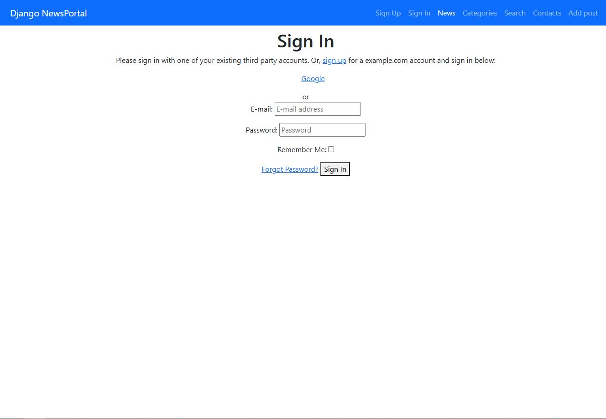
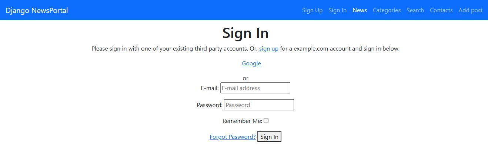
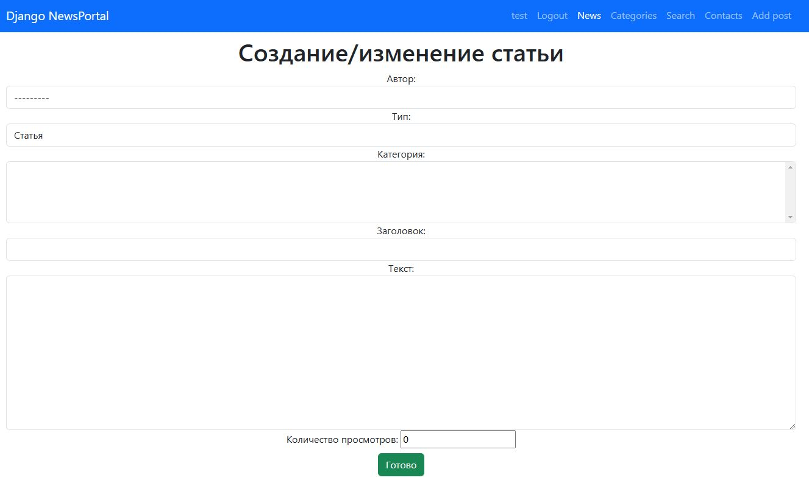
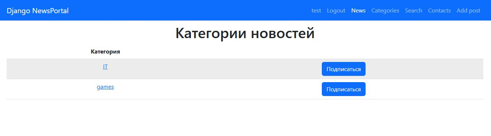
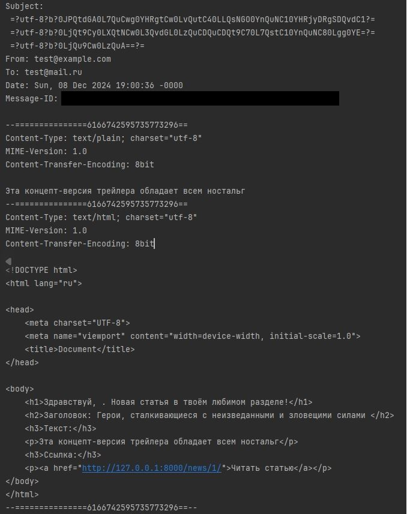
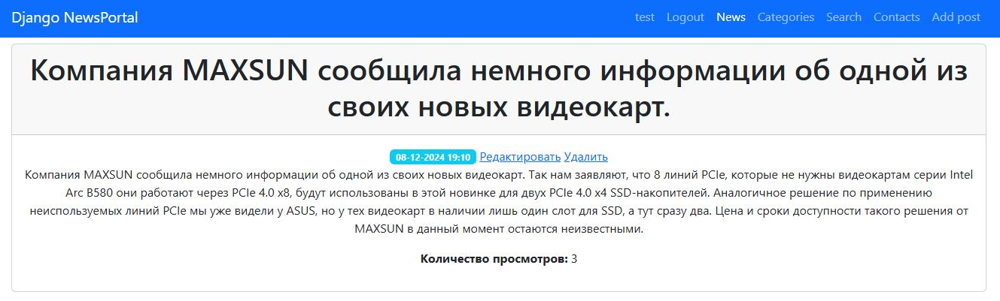

# **NewsPortal — Новостной портал**

## **Начало работы**

### **1. Клонирование репозитория**

Сначала клонируйте репозиторий с GitHub и перейдите в созданную директорию:

```bash
git clone https://github.com/Название_репозитория
cd NewsPortal
```

### **2. Активация виртуального окружения**

Активируйте виртуальное окружение для вашего проекта (если оно ещё не настроено).

### **3. Установка зависимостей**

Установите все необходимые зависимости для проекта:

```bash
pip install -r requirements.txt
```

### **4. Создание директории для логов**

Создайте директорию для логов:

```bash
mkdir logs
```

### **5. Применение миграций**

Примените миграции для настройки базы данных(предварительно создайте файл `.env` 
(за основу можно взять `.env.example`) и добавьте в него секретный ключ(команда для генерации 
ключа указана ниже)):

```bash
python manage.py migrate
```

### **6. Запуск сервера разработки**

Теперь вы можете запустить сервер разработки:

```bash
python manage.py runserver
```

---

### **Дальнейшие шаги**
После запуска сервера разработка и тестирование проекта будут доступны по адресу:  
[http://127.0.0.1:8000/](http://127.0.0.1:8000/).

### **Полезные команды для работы с проектом**

### **1. Генерация секретного ключа**
Используйте следующую команду для генерации случайного секретного ключа:

```bash
python -c "from django.core.management.utils import get_random_secret_key; print(get_random_secret_key())"
```

---

### **2. Применение миграций**
Последовательно выполните команды для настройки базы данных:

```bash
python manage.py makemigrations
python manage.py migrate
```

---

### **3. Создание суперпользователя**
Для создания суперпользователя выполните:

```bash
python manage.py createsuperuser
```

---

### **4. Запуск рассылки подписчикам**
Для запуска рассылки новостей подписчикам с помощью `apscheduler` выполните:

```bash
python manage.py runapscheduler
```

---

## **Скриншоты**
Регистрация и авторизация пользователя:





Добавление новости на сайте:



Подписка на новости:



Рассылка подписчикам новостей:

По времени:


Мгновенная рассылка:



Счётчик новостей:

